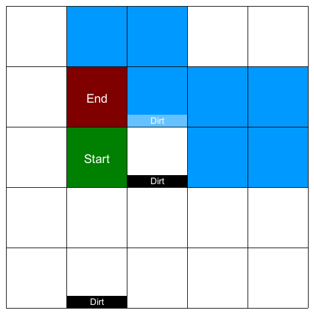

# scanzoniHoover

## Introduction

This is a program that navigates a imaginary robotic hoover (much like a [Roomba](https://en.wikipedia.org/wiki/Roomba)) through an equally imaginary room based on:

* room dimensions as [X and Y coordinates](https://en.wikipedia.org/wiki/Cartesian_coordinate_system), identifying the top right corner of the room rectangle. This room is divided up in a grid based on these dimensions; a room that has dimensions X: 5 and Y: 5 has 5 columns and 5 rows, so 25 possible hoover positions. The bottom left corner is the point of origin for our coordinate system, so as the room contains all coordinates its bottom left corner is defined by X: 0 and Y: 0.
* locations of patches of dirt, also defined by X and Y coordinates identifying the bottom left corner of those grid positions.
* an initial hoover position (X and Y coordinates like patches of dirt)
* driving instructions (as [cardinal directions](https://en.wikipedia.org/wiki/Cardinal_direction) where e.g. N and E mean "go north" and "go east" respectively) 

The room will be rectangular, has no obstacles (except the room walls), no doors and all locations in the room will be clean (hoovering has no effect) except for the locations of the patches of dirt presented in the program input.

Placing the hoover on a patch of dirt ("hoovering") removes the patch of dirt so that patch is then clean for the remainder of the program run. The hoover is always on - there is no need to enable it.

Driving into a wall has no effect (the robot skids in place).

## Goal

The goal of the program is to take the room dimensions, the locations of the dirt patches, the hoover location and the driving instructions as input and to then output the following:

* The final hoover position (X, Y)
* The number of patches of dirt the robot cleaned up

## Input

Program input is be received in a file with the format described here.

The file is named `input.txt` and resides in the same directory as the executable program.

Example:

```
5 5
1 2
1 0
2 2
2 3
NNESEESWNWW
```

* the first line holds the room dimensions (X Y), separated by a single space (all coordinates will be presented in this format)
* the second line holds the hoover position
* subsequent lines contain the zero or more positions of patches of dirt (one per line)
* the next line then always contains the driving instructions (at least one)

## Output

Program output is printed to the standard output (STDOUT) of the terminal and a png is created in the same directory as the program which maps the end state of the room after running the hoover

### Terminal
* The first line of the program output displays the X and Y coordinates marking the position of the hoover after processing all commands.
* The second line of the program output displays the number of patches of dirt the robot cleaned up

Example (matching the input above):

```
1 3
1
```

### Output Map
* A grid is drawn to show the dimensions of the room -- `0 0` is in the lower left corner
* The `Green` square indicates where the hoover started
* The `Blue` squares indicate where the hoover navigated during its run
* The `Red` square indicates where the hoover ended
* The `White` squares indicate what the hoover left untouched
* Dirt patches are labled `Dirt`

Example (matching the input above):



## Program / Requirements

* is a command-line / terminal application
* was tested on MacOS Catalina but should also run on Linux (x86-64)
* is written using `NodeJS v12.13.1` though older versions should work
* makes use of `fs` to interact with the filesystem and `canvas` to generate a PNG file mapping the results of the hoover job 

## Installation and Run Instructions

1. download and install [NodeJS](https://nodejs.org/en/download/) -- the LTS version should be fine
1. install/update the `fs` and `canvas` libraries by entering `npm install fs` and `npm install canvas` into your termial window
1. download or clone the latest source from this repository to a local directory that your account has read/write access to
1. open a terminal, navigate to the program's location, and run: `node runHoover.js`
    * the program will output two lines to display where the hoover currently sits and how many dirt piles were cleaned
1. you can also navigate to your directory to find the `hooverOutputMap.png` file